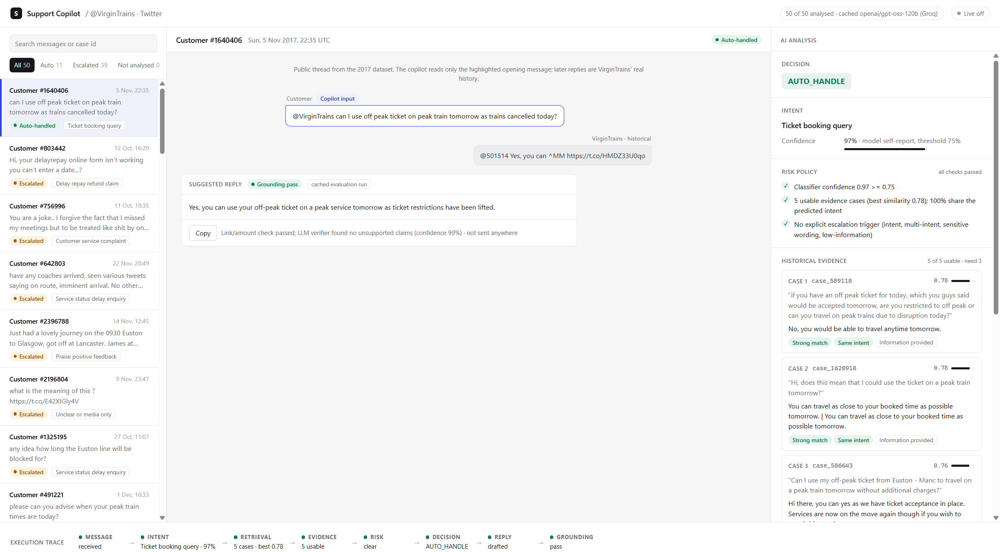
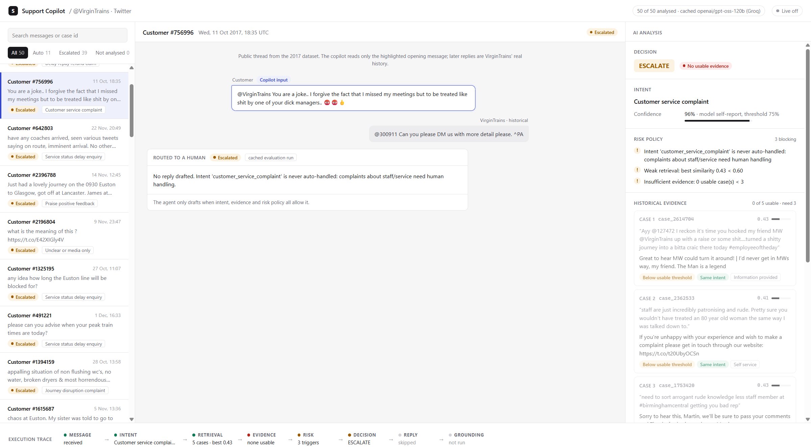
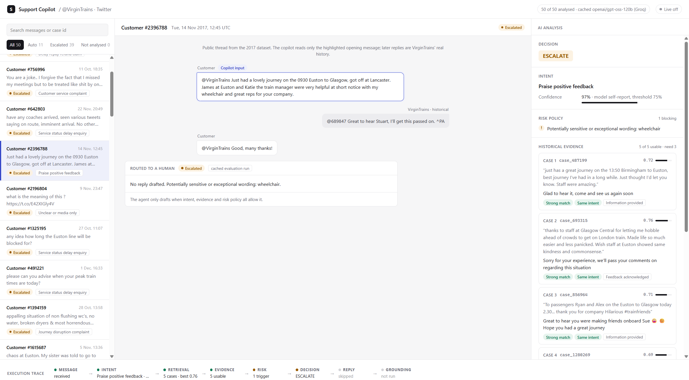
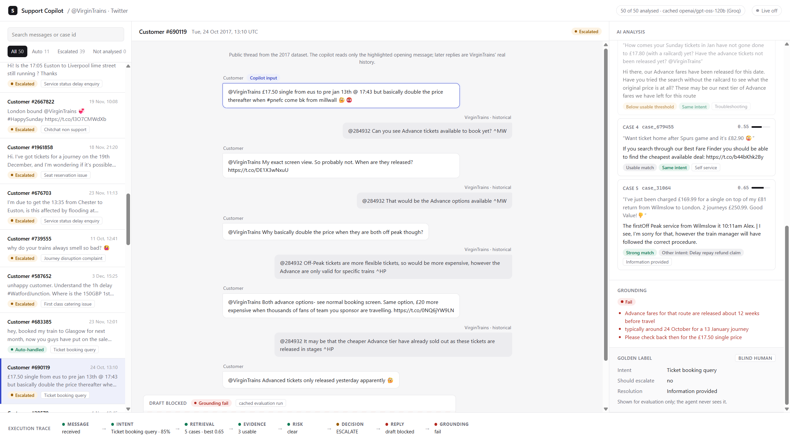

# VirginTrains support copilot: evidence before generation

My take-home for the Hiver SDE Intern role. The brief: pick one brand from the
[Customer Support on Twitter](https://www.kaggle.com/datasets/thoughtvector/customer-support-on-twitter) dataset and build a
support agent that (1) classifies incoming messages into intents defined from the data, (2) drafts replies grounded in how
the brand actually resolved similar issues, and (3) decides whether to auto-handle or escalate, with a reason. Then show
whether it can be trusted.

**Contents:**
[1 Executive summary](#1-executive-summary) ·
[2 Problem framing](#2-problem-framing) ·
[3 Dataset and methodology](#3-dataset-and-methodology) ·
[4 Architecture](#4-architecture) ·
[5 Golden set](#5-golden-set-methodology) ·
[6 Baselines](#6-baselines) ·
[7 Intent results](#7-intent-classification-results) ·
[8 Retrieval results](#8-retrieval-results) ·
[9 End-to-end routing](#9-end-to-end-routing-results) ·
[10 Reply quality](#10-reply-quality-evaluation) ·
[11 Failure modes](#11-top-5-failure-modes) ·
[12 Misleading headline](#12-what-is-misleading-about-my-headline-number) ·
[13 Decision log](#13-key-design-decisions) ·
[14 Next week](#14-what-id-do-with-one-more-week) ·
[Reproduce](#reproducing-the-results) ·
[Repo map](#repo-map)

---

## 1. Executive summary

I picked **VirginTrains** and built a support copilot around one idea: **evidence before generation**. The agent does not
write a reply until it has found strong precedent in how VirginTrains itself resolved similar tweets, and a deterministic
policy has checked the risk. Anything it can't support goes to a human, with its reasons and the evidence it found.

| what | result | status |
|---|---|---|
| Intent classification, **100 blind human labels** (headline) | LLM classifier 60.0% accuracy / 0.533 macro-F1, vs TF-IDF 54.0% / 0.466 and majority class 15.0% / 0.024 | final |
| Intent classification, all 250 reviewed labels | LLM 65.6% / 0.573 (secondary: 150 labels began as assistant drafts) | final |
| Retrieval, 857 dev queries (proxy relevance) | hybrid + intent bonus MRR 0.572, R@5 0.784, vs BM25 0.372 / 0.551 and random 0.152 / 0.237 | final, proxy |
| End-to-end routing on a 50-case golden slice | 11 of 50 auto-handled (22%); 1 of those 11 should have escalated (9.1%); 12 of 13 must-escalate cases escalated; 27 of 37 automatable cases escalated anyway | final, small sample |
| Reply quality: LLM judge vs human ratings | 14 drafts judged; [HUMAN RATINGS PENDING — judge-vs-human agreement not yet computed] | **incomplete** |

The agent is conservative, as designed: it automates a fifth of the slice, with one unsafe auto-handle, and pays for that
with heavy over-escalation. The only step left is the human side of the judge check, which needs a person to rate 14
replies blind ([Reproducing the results](#reproducing-the-results), step 7).



*The local Support Copilot UI (`python scripts/run_copilot_ui.py`). It shows real cached agent runs: decision, intent,
risk checks, the historical VirginTrains replies used as evidence, and the execution trace. It shows no chain-of-thought.
Above is an AUTO_HANDLE case whose reply passed grounding. Below are three escalations from the same run.*

| Escalated: staff complaint, no usable evidence (`case_756996`) | Escalated: praise mentioning a wheelchair, an over-escalation (`case_2396788`) |
|---|---|
|  |  |
| **Draft blocked by grounding (`case_690119`)** | |
|  | The policy allowed this case through, but the draft added claims the evidence doesn't support (a fare-release timeline), so grounding failed and the agent escalated instead of replying. The trace ends in "draft blocked" and "fail". |

---

## 2. Problem framing

VirginTrains customers tweet about a few recurring things: is my train running, the train is late or packed, Delay Repay,
booking and seats, wifi, first-class catering, and a lot of praise and banter. **Many of those can't be answered safely
from history alone.** "Is the 17:30 to Euston cancelled?" needs live data, and a refund needs an account lookup. A
confident wrong reply is worse than no reply.

So for this brand, **good** means:

1. **Never be confidently wrong.** An auto-handled reply must be supported by what VirginTrains actually said in similar
   past cases: no invented links, amounts, policies or "I've refunded you".
2. **Escalate the right things.** Live status, money, complaints about staff, safety and accessibility go to a human, with
   a reason a human can act on.
3. **Automate only the boring, safe part**: general information, self-service steps, wifi, thanking people. That's where
   historical replies are repetitive and safe to reuse.

Precision on auto-handled messages matters far more than coverage. I'd rather escalate 70% of traffic and be right on the
other 30% than the reverse. The baseline that matters is "always escalate": zero risk, zero automation.

**Out of scope on purpose:** Hiver/Twitter API integration, databases, auth, deployment, multi-agent orchestration, vector
databases, rerankers and fine-tuning. The agent has no live train data or account access, which is exactly why the
policy escalates those intents.

---

## 3. Dataset and methodology

- **Brand choice.** The dataset has 2.8M tweets across 108 brands. I ranked 78 eligible brands on volume, reconstructable
  multi-turn threads, template repetition, intent diversity and how often resolutions are visible. VirginTrains ranked
  3rd, and I picked it over the top two because it resolves *in public*: 3.3% of its replies go to DM, against 31.5% for
  Tesco. You can't learn resolutions you can't see.
- **Cases.** I rebuilt reply threads and attributed each tweet to a customer, giving 14,853 conversations, 65,810 tweets and
  17,913 support cases (one per customer episode, new episode after a 24-hour gap). 16% are visibly resolved and 4% move
  to DM.
- **Resolution signals.** Rule-based, no LLM: each case gets a resolution type (information provided, self-service,
  refund, troubleshooting, feedback acknowledged, …) with the exact sentence that triggered it quoted as evidence.
- **Candidate taxonomy.** Entity-masked MiniLM embeddings and KMeans (k=12) gave 10 candidate intents plus a fallback.
  Clusters are soft (silhouette ≈ 0.05), so the taxonomy is marked *candidate*, not ground truth.
- **Splits.** Customer- and thread-grouped hashing, with the golden pool carved out *before* clustering:
  train 14,213 · dev 2,210 · golden 250 · reserve 1,240. Leakage checks (same customer, thread, tweet or near-duplicate
  opener) pass with zero overlaps.
- **Resolution memory.** Only train-split cases with *strong* resolution evidence: 10,380 of 14,213. The exclusions are listed
  in [`docs/reference.md`](docs/reference.md#resolution-memory).

Every step is seeded (42). Details, schemas and the brand-ranking weights are in [`docs/reference.md`](docs/reference.md).

---

## 4. Architecture

```text
 twcs.csv (2.8M tweets) ─► VirginTrains cases (17,913) ─► resolution signals (rules, quoted evidence)
                                     │
            candidate taxonomy ◄─────┼─────► splits (train / dev / golden / reserve)
                                     ▼
                      resolution memory (train only, strong evidence)

 ┌─────────────────────────── support agent (src/agent/support_agent.py) ───────────────────────────┐
 │ MESSAGE   opening customer tweet                                                                  │
 │ INTENT    LLM classifier: candidate intents, JSON, temperature 0, self-reported confidence        │
 │ RETRIEVAL hybrid BM25 + MiniLM embeddings + soft intent bonus, top 5 past resolutions             │
 │ EVIDENCE  similarity thresholds, usable-evidence count, intent agreement                          │
 │ RISK      deterministic policy: blocked intents, sensitive wording, multi-intent, low information │
 │ DECISION  ESCALATE → no reply; reasons + evidence for the human                                   │
 │           AUTO_HANDLE → REPLY drafted from the evidence only → GROUNDING                          │
 │ GROUNDING link/£-amount check + LLM verifier; any failure or verifier error → ESCALATE            │
 └───────────────────────────────────────────────────────────────────────────────────────────────────┘
```

- **The evidence is the brand's own history.** Retrieval returns past *resolutions* (customer problem, VirginTrains'
  reply, outcome), each with its `case_id` and source tweet ids, so any reply can be traced to real tweets.
- **The LLM proposes, plain code decides.** The model classifies, drafts and verifies; the auto-handle decision is made by
  thresholds in one file, [`configs/support_agent.yaml`](configs/support_agent.yaml): classifier confidence ≥ 0.75, top
  similarity ≥ 0.60, at least 3 usable cases (similarity ≥ 0.55), message at least 3 words.
- **Five intents never auto-handle:** service status, journey disruption, Delay Repay, customer-service complaints and
  unclear messages. Sensitive wording (legal, safety, accessibility, theft, refunds, …) also forces escalation.
- **Grounding only makes the agent more cautious.** It can turn AUTO_HANDLE into ESCALATE, never the reverse.
- **One thin model layer.** `LanguageModel` interface with REST clients for Groq ([`groq.py`](src/models/groq.py)) and
  Gemini ([`gemini.py`](src/models/gemini.py)): timeouts, retries, JSON mode, keys never logged or put in errors.
  The scripts default to Groq's `openai/gpt-oss-120b` (`--provider gemini` switches). Tests use fakes and need no key.

Code: [`classifier.py`](src/agent/classifier.py) · [`retrieval.py`](src/retrieval.py) · [`policy.py`](src/agent/policy.py) ·
[`generator.py`](src/agent/generator.py) · [`grounding.py`](src/agent/grounding.py) · [`schemas.py`](src/agent/schemas.py).

---

## 5. Golden set methodology

**Sampling.** 250 cases from the held-out golden pool, stratified by candidate cluster, resolution type, conversation
length, DM redirect and resolved. That over-represents rare and hard cases; `golden_stratum_weight` restores natural
prevalence. No golden customer, thread, tweet or near-duplicate opener appears in train or dev.

**Labeling.** A local blind tool ([`label_golden_eval.py`](scripts/label_golden_eval.py)) shows the full conversation and the
provisional taxonomy, and **never any model output**. The labeler records `gold_intent` (or `NEW:<name>`),
`gold_should_escalate` (judged against what *this* system can do), `gold_resolution_type`, confidence and notes.

**Provenance.** 250 cases have final human-reviewed labels; 100 were labelled blindly by a human and 150 were initially
generated as assistant drafts and subsequently reviewed by a human (150 confirmed, 0 corrected). The audit log records
the source of every label.

- **The blind 100 are the primary evaluation set.**
- **The 250 are secondary.** Reviewing a draft is weaker than labeling blind: the draft can anchor the reviewer, and the
  150 confirmations took about six minutes in total, so I treat them as a light review. Drafts written by an LLM may also
  agree more with another LLM.

**Freeze.** Golden labels, split membership and the taxonomy were frozen before any golden scoring. The golden set was
never used to tune retrieval weights, prompts, thresholds or the taxonomy.

**Label distribution.** `gold_should_escalate`: 52 yes / 198 no on all 250, and 19 yes / 81 no on the blind 100. Label
confidence: 181 high, 59 medium, 4 low, 6 not given.

---

## 6. Baselines

| layer | trivial baseline | simple baseline | system |
|---|---|---|---|
| intent | majority class | TF-IDF + logistic regression trained on the train split's weak cluster intents, `C` chosen on dev | agent's LLM classifier (`gpt-oss-120b` on Groq) |
| retrieval | random | BM25 | hybrid BM25 + embeddings + soft intent bonus |
| routing | always escalate (0 unsafe auto-handles, 0% automation) | – | full agent |

All systems get only the opening customer message: the same input the agent gets.

---

## 7. Intent classification results

Full report: [`reports/intent_eval/virgintrains_intent_evaluation.md`](reports/intent_eval/virgintrains_intent_evaluation.md)
(per-intent precision/recall/F1 and confusion matrices).

| system | **blind human (100)**: accuracy | macro-F1 | all reviewed (250): accuracy | macro-F1 |
|---|---|---|---|---|
| Majority class (`service_status_delay_enquiry`) | 15.0% | 0.024 | 12.4% | 0.018 |
| TF-IDF + logistic regression | 54.0% | 0.466 | 49.6% | 0.409 |
| **LLM: agent's classifier on `gpt-oss-120b` (Groq)** | **60.0%** | **0.533** | 65.6% | 0.573 |

- **The errors are mostly confusable intents.** `journey_disruption_complaint` and `customer_service_complaint` bleed
  into each other (F1 0.47 and 0.43). The LLM rarely picks `unclear_or_media_only` (recall 0.25). Delay Repay
  predictions are always right (precision 1.00), but it finds only about half of them.
- **Wrong answers come with high confidence.** 32 of the 40 blind errors had self-reported confidence ≥ 0.90, so the 0.75
  confidence gate doesn't catch them (see [failure modes](#11-top-5-failure-modes)).
- **The baseline learned weak labels.** Against the same weak labels on dev it scores 0.77 macro-F1; against human labels it
  drops to 0.47. Most of that gap is the cluster labels disagreeing with people.
- **The input is narrower than what the labeler saw**: labels come from the whole conversation, predictions from the
  opening tweet.
- **Two golden cases use `NEW:lost_property`**, which no system can predict; they count as errors for everyone.
- **Taxonomy limitation.** The candidate cluster intent differs from the final gold intent on 131 of 250 cases
  ([taxonomy review](reports/golden_taxonomy_review.md)). I report this as a limitation and did not retune against it.

---

## 8. Retrieval results

These are **proxy metrics.** Queries are 857 held-out dev cases; the corpus is the 10,380-case train memory. A retrieved case
counts as relevant if it has the same candidate intent *and* the same rule-derived resolution type. Weights were tuned
on a separate half of dev. Report:
[`reports/virgintrains_retrieval_evaluation.md`](reports/virgintrains_retrieval_evaluation.md).

| strategy | R@1 | R@3 | R@5 | MRR (95% CI) |
|---|---|---|---|---|
| Random (trivial) | 0.053 | 0.156 | 0.237 | 0.152 |
| BM25 (simple) | 0.223 | 0.447 | 0.551 | 0.372 (0.349–0.396) |
| Embeddings (MiniLM) | 0.287 | 0.522 | 0.616 | 0.443 (0.418–0.470) |
| Hybrid (0.9 semantic) | 0.299 | 0.518 | 0.623 | 0.445 (0.420–0.472) |
| **Hybrid + soft intent bonus (0.15)** | **0.407** | **0.690** | **0.784** | **0.572 (0.547–0.598)** |

**Stress test.** With 30% of predicted intents wrong, the soft bonus still beats query-only retrieval (MRR 0.519 vs 0.445),
while a hard intent filter drops below it (0.404). That's why intent is a nudge and never a filter.

---

## 9. End-to-end routing results

`scripts/evaluate_agent.py` runs the real `SupportAgent.handle` on a 50-case golden slice, stratified by gold intent and
gold escalation (at least 3 per intent, seed 42; 48 of the 50 have blind human labels). It scores routing against
`gold_should_escalate` and checks pipeline invariants on every case.

The slice has 13 cases where gold says escalate and 37 where it doesn't. Report:
[`reports/agent_eval/virgintrains_agent_evaluation.md`](reports/agent_eval/virgintrains_agent_evaluation.md).

| metric | definition | always escalate (baseline) | **agent, all 50** | agent, blind-labelled 48 |
|---|---|---|---|---|
| auto-handle rate | share of cases answered without a human | 0% | **22.0%** (11) | 22.9% |
| false auto-handle rate | auto-handled but gold says escalate, over auto-handled | – | **9.1%** (1 of 11) | 9.1% |
| safe automation rate | auto-handled and gold says no escalation, over all cases | 0% | **20.0%** | 20.8% |
| escalation recall | escalated, over gold says escalate | 100% | **92.3%** (12 of 13) | 91.7% |
| escalation precision | gold says escalate, over escalated | 26.0% | **30.8%** (12 of 39) | 29.7% |
| intent accuracy | predicted equals gold intent | – | 58.0% | 58.3% |

**Pipeline stages.**
- The policy allowed 15 of the 50 cases to auto-handle.
- The generator produced 14 drafts and declined 1.
- Grounding passed 11 of the 14 drafts. The 3 failures were downgraded to ESCALATE: each draft had added a detail the evidence
  doesn't contain (a fare-release date, a claim that a specific service has no reservations, a payment-options claim).
- There were 0 model errors, classification failures or pipeline-invariant violations.

**Why cases were escalated.**
- 18 were blocked intents.
- 5 had weak retrieval.
- 4 had evidence showing that similar cases needed account access.
- 3 failed grounding.
- 3 looked like they contained more than one request.
- The rest were low-information messages, sensitive wording, insufficient evidence, evidence that disagreed with the
  predicted intent, or the generator declining.

**Reading it.** Against "always escalate", the agent takes 11 of 50 cases off a human's queue. It gets one wrong:
`case_2884600`, a customer charged £102 to change a ticket. The agent replied with the Aftersales number and fee rule,
which grounding accepted, but the human label says it needed escalation. The failure analysis had already flagged this
case as one that [no hard rule catches](#11-top-5-failure-modes). The cost is over-escalation: 27 of the 37 cases that could have been automated
went to a human, most of them because of blanket intent rules. With 50 cases, a single error moves the false auto-handle
rate by 9 points, so these are estimates of direction, not stable rates.

---

## 10. Reply-quality evaluation

`scripts/judge_replies.py` scores every draft reply (including drafts the grounding check blocked) with an LLM judge,
1–5 on four dimensions:

- **correctness**: right for this customer's message;
- **groundedness**: every fact, link, price and promise supported by the evidence;
- **actionability**: the customer knows what to do next;
- **brand alignment**: polite, concise, plain, no promises it can't keep.

The rubric is frozen in [`src/evaluation/llm_judge.py`](src/evaluation/llm_judge.py), and its hash is stored with every
score. Before trusting the judge, it's checked against a human. The script writes `human_ratings.csv`, a blind sheet of up
to 40 replies that never shows judge scores, and computes exact agreement, quadratic-weighted Cohen's κ, Spearman ρ and
mean absolute difference per dimension. With fewer than 30 rated replies the report labels agreement "indicative, not
reliable".

| | result |
|---|---|
| judge scores on the 14 drafts | [WITHHELD UNTIL HUMAN RATINGS ARE IN — see below] |
| judge vs human agreement (κ, ρ) | [HUMAN RATINGS PENDING — DO NOT FABRICATE] |

**Status:** The judge has scored all 14 drafts (11 sent, 3 blocked by grounding), and the blind rating sheet has been written.
I'm leaving the judge's scores out of this README until the human ratings are in, so the rater isn't anchored by them. With
14 replies, agreement will be reported as indicative only (fewer than 30).

**What routing metrics miss.** `case_1035449`, "always wondered what it must be like to travel by train in India
#mightaswellallsitontheroof", is sarcasm about overcrowding. The agent read it as praise and replied "Thanks for the kind
words! Glad you enjoyed your journey." The gold label says this case needn't escalate, so routing counts it as a *safe*
auto-handle, and grounding passed because the evidence contains similar thank-you replies. Only a reply-quality check
catches this, which is why the judge-vs-human step matters.

---

## 11. Top 5 failure modes

From [`reports/failure_analysis.md`](reports/failure_analysis.md), generated by `scripts/analyze_failures.py` from existing
artifacts only (no model calls). Every example is a real case id.

1. **Policy over-escalation (policy).** Apply the hard rules to the *gold* intent of the blind 100, as if the classifier
   were perfect. Of the 81 cases a human said needn't escalate, 40 would still be escalated: 37 by an intent rule, 7 by
   sensitive wording, 1 for low information. Examples: `case_2396788` is praise, escalated because it mentions a
   wheelchair; `case_1615687` is a simple "how to get a refund?". The agent run shows the same thing: 27 of 37 automatable
   cases were escalated. *Fix:*
   gate on the action needed rather than the intent, and scope sensitive words to complaints. Tune on dev.
2. **Intent boundary ambiguity (taxonomy).** 14 of the 40 blind errors are between two pairs: journey disruption vs status
   enquiry (`case_2639881`, `case_509179`), and chitchat vs praise. The candidate taxonomy disagrees with gold on 131 of 250
   cases. A delayed train is both a status question and a complaint. *Fix:* define intents by the action the brand must
   take, with decision rules for the top pairs.
3. **Confidently wrong classifications (model).** 32 of 40 blind errors had confidence ≥ 0.90. For example,
   `case_2607464`, a heart-condition complaint about the toilet voice, was called chitchat at 0.97. *Fix:* calibrate on
   dev, or replace self-reported confidence with retrieval-agreement signals. The hard rules downstream limit the damage.
4. **Right topic, wrong handling (retrieval).** 178 of the 185 dev queries with no relevant top-5 hit found the right intent
   but the wrong resolution type. `case_527334`, "can I use virgin from Watford with this??", was historically a refund;
   the first relevant hit was at rank 246. The opening tweet doesn't contain what decided the handling.
5. **The request isn't in the tweet (data).** 19 of 250 golden cases are about another operator's train, where the right
   answer is a redirect that no intent captures (`case_482898`). 7 are media-only or unclear, and the LLM labelled only 2 of
   those as unclear (`case_1845809`: "your trains are disgusting.... <link>").

Also tracked:
- **Hard-rule gaps.** 3 of the 19 blind should-escalate cases trigger no hard rule, so only the soft checks stand between
  them and an auto-reply. One of them, `case_2884600` (a £102 change fee), was auto-handled in the agent run: the only
  unsafe auto-handle.
- **Grounding catches invented detail.** 3 of 14 drafts failed and were blocked, for example `case_690119`, where the draft
  invented a fare-release date.
- **Generator declines.** The generator declined 1 of 15 (`case_166715`, a joke about the toilet voice).
- **Model errors.** None occurred in the run, so the UI's model-error state is covered only by unit tests.

---

## 12. What is misleading about my headline number?

The headline is **60.0% intent accuracy (0.533 macro-F1) on 100 blind labels**. Reasons not to over-read it:

1. **It rests on 100 labels.** A 95% interval on 60% with n=100 is roughly ±10 points, so the 6-point gap over TF-IDF is
   suggestive, not proven.
2. **The 250-case number is higher, and that's a warning, not a bonus.** 150 of those labels began as assistant drafts that
   were confirmed quickly; LLM-drafted labels plausibly favour an LLM classifier. It's reported as secondary.
3. **Intent accuracy is partly a taxonomy measurement.** The candidate intents overlap (131 of 250 candidate/gold
   disagreements, silhouette ≈ 0.05). Some "errors" are defensible second readings of the same tweet, and some
   "correct" answers depend on where I drew a boundary.
4. **Retrieval metrics are proxies.** Relevance is "same candidate intent + same rule-derived resolution type", and the
   intent bonus uses the same intent, so the best row is partly self-confirming. No human has judged a retrieved case as
   useful.
5. **The end-to-end slice is small and not representative.** 50 cases, stratified to over-represent rare intents and
   escalations. Its rates won't match real traffic (`golden_stratum_weight` gives prevalence). The 9.1% false
   auto-handle rate is a single case, and one more error would nearly double it.
6. **Low coverage isn't automatically failure.** The policy is deliberately conservative, and "always escalate" is a valid
   baseline. The question is whether each extra automated case is safe. The oracle analysis shows that much of the
   over-escalation is by design, in the rules, not caused by model errors.
7. **The judge is only trustworthy once checked against enough human ratings.** There are 14 replies and no human ratings
   yet. Even after rating, agreement on 14 replies is indicative only. Routing "safe" doesn't mean the reply is good
   (`case_1035449` thanked a sarcastic complainant).
8. **Resolution signals are weak heuristics.** Resolution types come from regexes over the brand's reply ("refund" means a
   refund was *discussed*). DM-resolved cases are invisible. Both the memory filter and the retrieval relevance inherit
   this noise.

---

## 13. Key design decisions

1. **VirginTrains over higher-ranked brands.** It resolves in public (3.3% DM vs 31.5% for Tesco), so resolutions are
   learnable.
2. **One case per customer episode, 24-hour gap.** Busy threads mix several customers and other operators' agents.
3. **Rule-based resolution labels with quoted evidence; only strong evidence enters memory.** Weak labels, but each is
   auditable, and nothing is paraphrased by an LLM.
4. **Mask entities before clustering, and keep the taxonomy a candidate.** Without masking, clusters were train routes.
   Clusters are soft, so nothing calls them ground truth.
5. **Golden carved out first; split by customer and thread groups.** Random hashing would leak customers and templated
   replies across splits.
6. **Golden frozen and labelled blind; taxonomy calibration skipped.** The labeler never saw model output. I built a
   calibration workflow but skipped it to reach an end-to-end agent; `NEW:` intents plus the taxonomy review cover it.
7. **100 blind labels are primary, 150 reviewed drafts are secondary.** Every result is reported both ways, and the
   provenance is in the audit log.
8. **Retrieve resolutions, not documents; hybrid BM25 + embeddings; no vector DB or reranker.** 10k records fit in memory,
   and the question is "what did VirginTrains do last time?".
9. **Intent is a soft retrieval bonus, never a filter.** The stress test shows filters collapse when the classifier is wrong.
10. **Tune on one half of dev, report on the other.** Golden is never used for tuning.
11. **Deterministic policy, separate from the LLM.** LLM confidence is uncalibrated (32 of 40 errors at ≥ 0.90), so
    thresholds decide and list their reasons.
12. **Some intents always escalate.** Live status, Delay Repay and complaints need data or judgment this system doesn't
    have.
13. **Grounding fails closed.** It can only downgrade to ESCALATE; a verifier error counts as "not grounded".
14. **A 50-case stratified e2e slice with a cache, resume, and stop-on-rate-limit.** Free-tier quotas made a full golden run
    impractical, so every model call is cached and the run resumes where it stopped. One REST wrapper per provider; no
    SDK dependency.
15. **The judge comes with a frozen rubric hash, a blind human sheet, and agreement before trust.** Judge scores aren't
    reported as quality until they agree with a human.

---

## 14. What I'd do with one more week

1. **Finish the judge-vs-human check, then grow the e2e slice** to the full 250 golden cases, so the false auto-handle
   rate rests on more than one case.
2. **Fix the over-escalation found by the oracle**, calibrated on dev and not golden: gate on action needed, scope
   sensitive words, and report the auto-handle precision vs coverage curve.
3. **Redefine the taxonomy by required action** (live info / compensation / acknowledge / redirect), add
   `lost_property` and an "other operator" redirect path, and re-label after freezing the definitions.
4. **Calibrate classifier confidence on dev**, or replace it with retrieval-agreement signals.
5. **Re-review the 150 confirmed drafts slowly**, ideally blind, to promote them toward primary.

---

## Reproducing the results

Three kinds of steps. **Local**: deterministic, no API key. **Cached**: replays committed model outputs without an API call.
**Live**: calls an LLM and is subject to free-tier rate limits. The main data pipeline took about 5 minutes on my GPU
(CPU is slower). The live evaluations can't promise a time budget: the Groq free tier allows about 200K tokens a day, so the
scripts stop cleanly at the limit and resume on the next run, possibly a day later.

**1. Install** (Python 3.10+; tested on 3.11, Windows).

```bash
python -m venv .venv && .venv\Scripts\activate          # macOS/Linux: source .venv/bin/activate
pip install -r requirements.txt
python -m pytest -q                                      # local: no data or key needed, about 1 minute
```

**2. Data pipeline** (local). Needs `twcs.csv` in `data/raw/`.

```bash
python -c "import kagglehub, shutil; p = kagglehub.dataset_download('thoughtvector/customer-support-on-twitter'); shutil.copy(p + '/twcs/twcs.csv', 'data/raw/twcs.csv')"
python scripts/run_virgintrains_pipeline.py --input data/raw/twcs.csv   # cases, taxonomy, splits, EDA (~5 min on a GPU)
python scripts/build_resolution_memory.py                                # train-only resolution memory
python scripts/evaluate_retrieval.py                                     # -> reports/virgintrains_retrieval_evaluation.md
```

**3. Provider configuration.** Copy `.env.example` to `.env` and put **your own** key in it: `GROQ_API_KEY` (default
provider) or `GEMINI_API_KEY` (with `--provider gemini`). `.env` is git-ignored; keys are never printed or written to
reports.

**4. Smoke test** (live): 12 representative dev cases end to end.

```bash
python scripts/run_support_agent.py --message "The wifi on my train keeps dropping"
python scripts/smoke_test_agent.py --limit 12 --seed 42        # --select-only lists the cases without a key
```

**5. Intent benchmark** (local for baselines, cached for the LLM).

```bash
python scripts/evaluate_intents.py --skip-llm     # majority + TF-IDF, about 40 s
python scripts/evaluate_intents.py                # re-scores the LLM from the committed prediction cache; no API call
```

**6. End-to-end agent evaluation** (cached: the committed `model_cache.jsonl` replays every call, so a re-run makes no new
API calls, though the client still needs a key to start; delete the cache to run live).

```bash
python scripts/evaluate_agent.py --select-only    # the 50 cases, no key
python scripts/evaluate_agent.py                  # rerun after a rate limit: cached calls replay, only missing cases are sent
```

**7. Judge evaluation** (live, then a human step).

```bash
python scripts/judge_replies.py                   # judge scores + blind reports/agent_eval/human_ratings.csv
# fill in the human_* columns (1-5) without opening the judge outputs, then:
python scripts/judge_replies.py                   # adds judge-vs-human agreement
python scripts/analyze_failures.py                # local: refresh the failure analysis
```

**8. Support Copilot UI** (cached; live only on request).

```bash
python scripts/run_copilot_ui.py --no-live        # http://127.0.0.1:8770, shows cached agent runs only
python scripts/run_copilot_ui.py                  # with GROQ_API_KEY set, "Run agent live" analyses a pending ticket
```

**Golden labeling** (local): `python scripts/label_golden_eval.py` opens the blind tool; `--check` verifies the files and
prints provenance counts.

---

## Repo map

```text
src/
  ingestion/     loader, thread reconstruction, roles, episodes, resolution signals, case builder, resolution memory
  taxonomy/      entity masking, discovery (TF-IDF / embeddings / KMeans), taxonomy builder, registry
  evaluation/    brand ranking, splits + leakage checks, sampling, retrieval / intent / agent eval, LLM judge,
                 failure analysis, golden labeling and taxonomy review
  agent/         schemas, classifier, policy, generator, grounding, support_agent (orchestration), config
  models/        LanguageModel interface, Groq and Gemini REST clients, provider factory
  ui/            Support Copilot (stdlib HTTP server + one HTML page)
  retrieval.py   BM25 + embeddings + hybrid retriever
configs/         support_agent.yaml (all thresholds), virgintrains_intents.yaml (candidate taxonomy)
scripts/         one entry point per step (index in docs/reference.md)
reports/         EDA, clusters, retrieval, intent eval, taxonomy review, failure analysis
data/            raw/ (twcs.csv, not committed) · processed/ · golden/ (frozen labels, drafts, audit log)
docs/            reference.md (data contracts, pipeline details, script index), screenshots/ (Support Copilot UI)
tests/           pytest suite; no network or API key needed
```

## Assumptions, limitations and credits

- **Public view only.** Anything resolved in DMs, by phone or in person is invisible, so "resolved" is a lower bound.
- **Seven weeks of 2017 tweets** (mostly Oct–Dec 2017), so recurring disruption templates are over-represented, and nothing
  shows how the system holds up over time.
- **English-only regex heuristics** for resolution signals.
- **Thresholds are conservative starting values** chosen on dev, not tuned to a validated precision target.
- **Credits.**
  - Data: Customer Support on Twitter (Kaggle, thoughtvector).
  - Embeddings: `sentence-transformers/all-MiniLM-L6-v2`.
  - Clustering and TF-IDF: scikit-learn.
  - LLMs: OpenAI's open-weight `gpt-oss-120b` served by Groq (evaluation and default provider), and Google Gemini
    `gemini-2.5-flash` (supported provider, used for the first smoke test). Both are called over REST.
  - BM25 is my own implementation.
  - Written with an AI coding assistant; I can walk through and change any part of it.
